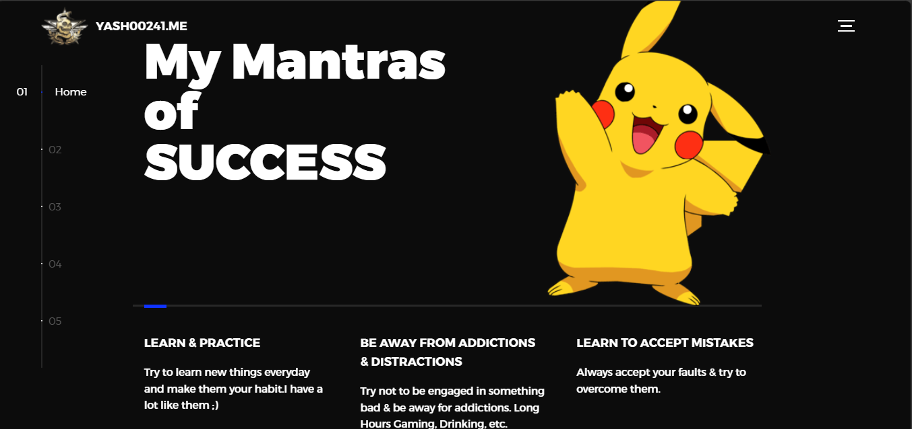
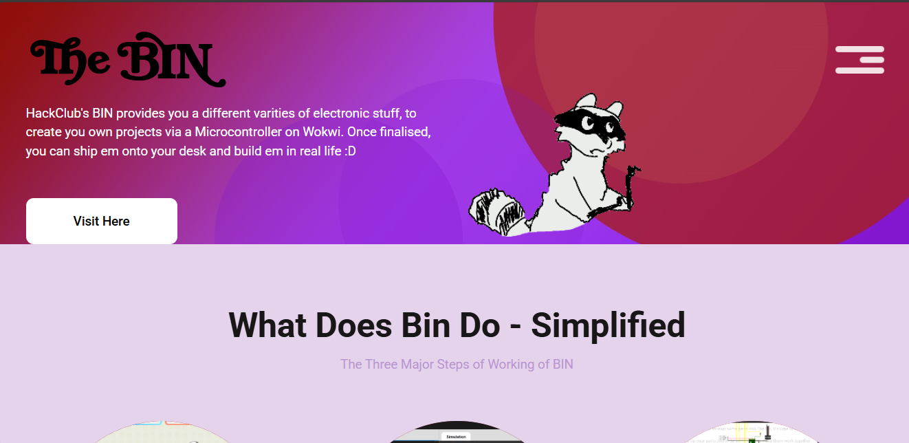
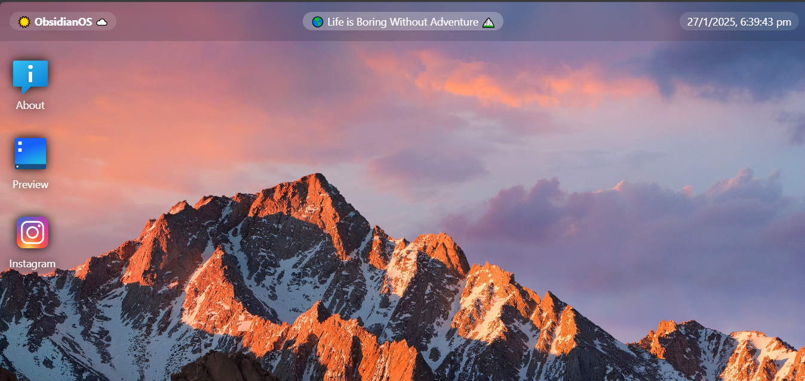

# 💼Portfolio Website  

Welcome to my **Personal Portfolio Website**! 🌟  

This is a one-stop website which tells about my journey, projects, and creations. 🚀📱  

---

## ✨ Features  

1. **Main Webpage** 🏠  
   - The starting point of my portfolio.  

2. **About Me** 👨‍💻  
   - A brief insight into who I am, my passions, and my goals.  

3. **The BIN** 🛍️  
   - A dedicated section about the BIN event of Hackclub :D 

4. **Web-Based Operating System** 🖥️  
   - An interactive system built directly into the website!

5. **About Hackclub** 👨‍💻
   - It showcases about Hackclub and its events! 

---

## 🌐 Technologies Used  

- **Responsive Design**: Ensures optimal viewing on all devices.  
- **Bootstrap.js**: Powers the design and interactive elements.  
- **Downloaded Resources**: Some leveraged external libraries for smooth functionality.  

---

## 📸 Website Screenshots  

  
*Screenshot of the Main Webpage*  

  
*Screenshot of the About Me Webpage*  

  
*Screenshot of The BIN*  

  
*Screenshot of the Web-Based OS*  

---

## 🚀 Demo  

Experience the portfolio live: **[Click Here!](https://yash00241.github.io/)**  

---  

### 🎉 Thank you for visiting!  
Feel free to explore and connect.💖  
